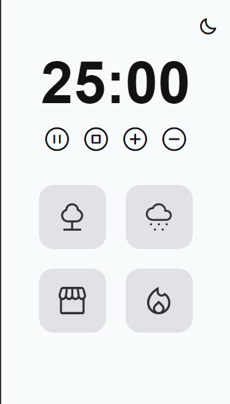

# FocusTimer-V2.0
 
<h1 align="center">Focus Timer V2 - Pomodoro</h1>

  

  

    Challenge - Focus Timer

    <a href="https://rafael-malaquias.github.io/FocusTimer-V2.0/">Project</a>&nbsp;&nbsp;&nbsp;|&nbsp;&nbsp;&nbsp;
    <a href="https://www.figma.com/design/ntBWn0cZ1V69xLy1UR7DXX/Stage-05---Focus-Timer-2.0-(Copy)?node-id=0-1&t=4OISzfITxH0alyXf-0">Layout</a>&nbsp;&nbsp;&nbsp;|&nbsp;&nbsp;&nbsp;
    <a href="#memo-licença">License</a>

## 🚀 Technologies

This project was developed with the following technologies:

- HTML
- CSS 
- JavaScript
- Git e Github

## 💻 Project
Focus Timer Page. 
 
For this project, create a Focus Timer - Pomodoro page to serve as a guide to maximize your productivity using the Pomodoro technique!

[Link](https://rafael-malaquias.github.io/FocusTimer-V2.0/) - To view the project.

## 🔖 Layout

 You can view the layout of the project through [THIS LINK.](https://www.figma.com/design/ntBWn0cZ1V69xLy1UR7DXX/Stage-05---Focus-Timer-2.0-(Copy)?node-id=0-1&t=4OISzfITxH0alyXf-0).

##  📝 License

This project is under the MIT license.

---

  

